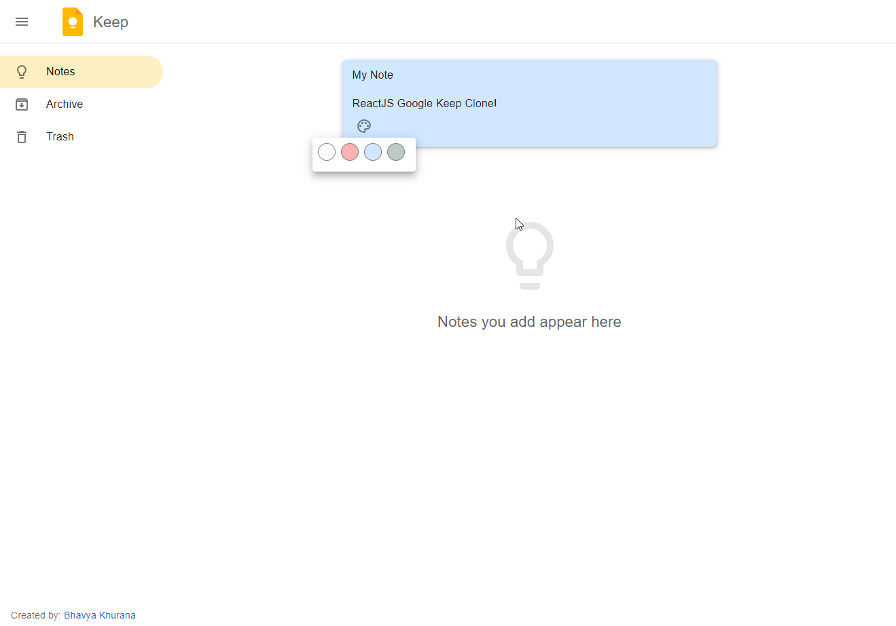
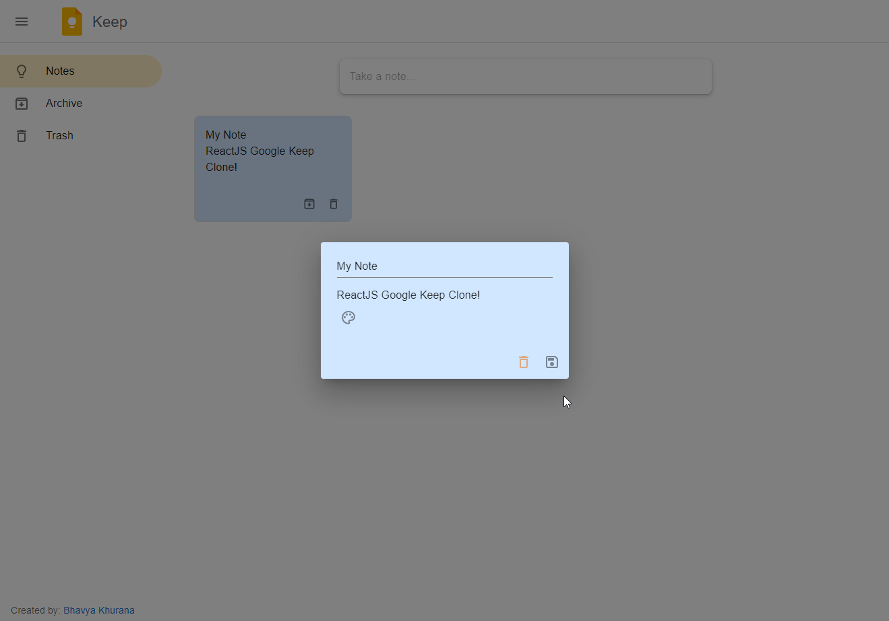
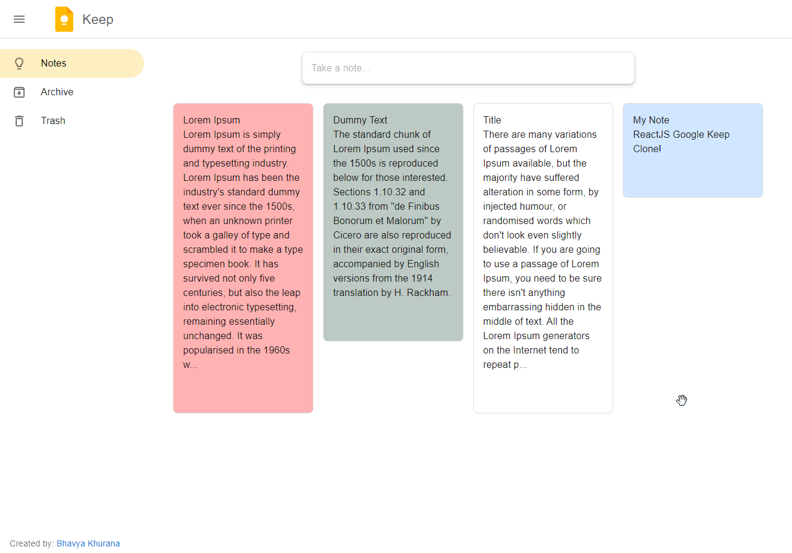
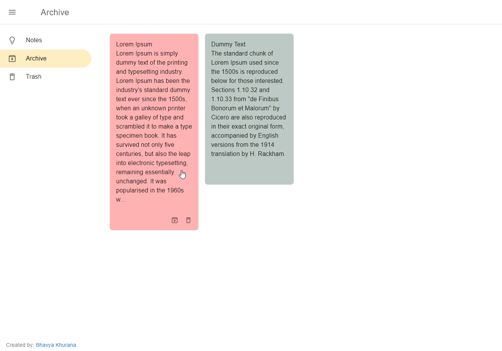
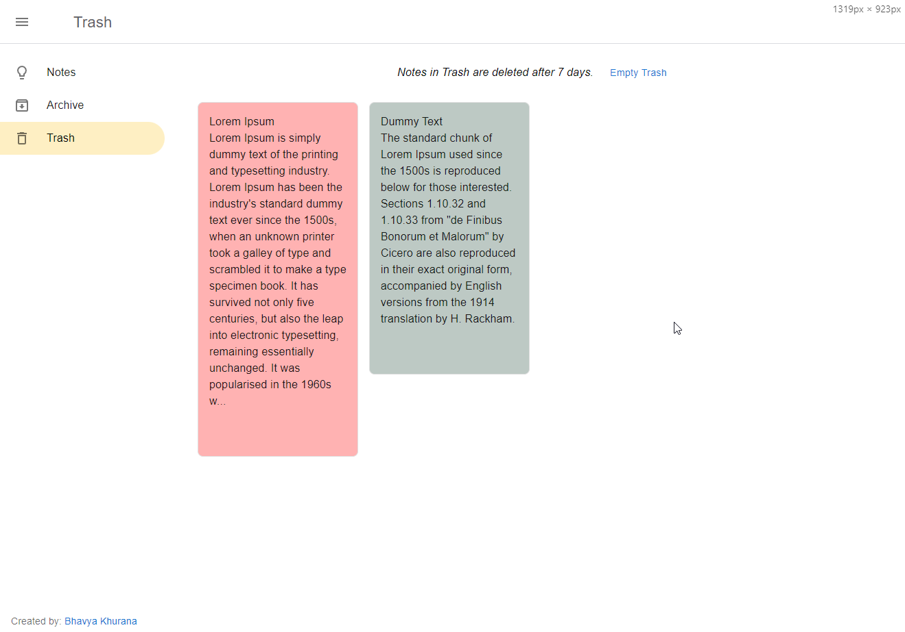

# Google Keep Clone

This is a clone of Google Keep created using **React** and **Material UI**. It allows users to add, archive, and delete
notes, with notes being stored in local storage. The app also features drag and drop functionality for notes and
automatically deletes deleted notes after 7 days.

## Table of Contents

- [Installation](#installation)
- [Usage](#usage)
- [Features](#features)
- [Dependencies](#dependencies)
- [Preview](#preview)

## Installation

To run the project locally, follow these steps:

1. Clone the repository
2. Install the dependencies: `npm install` or `npm install --legacy-peer-deps`
3. Start the development server: `npm start`

## Usage

To start the app, run `npm start`. This will start the app on [http://localhost:3000](http://localhost:3000) in your
browser.

## Features

- Add notes: Users can add new notes with a title and description.
- Archive notes: Users can archive notes to remove them from the main view.
- Delete notes: Users can delete notes permanently.
- Drag and drop: Users can rearrange the order of their notes by dragging and dropping them.
- Automatic deletion: Deleted notes are automatically deleted after 7 days.
- Add background colors to notes.

## Dependencies

```
npm i @emotion/react @emotion/styled  @mui/material
npm i @mui/icons-material
npm i @mui/styles
npm i react-router-dom
npm i uuid
npm i @hello-pangea/dnd
```


## Preview
<p>
  
  
  
  
  
</p>
